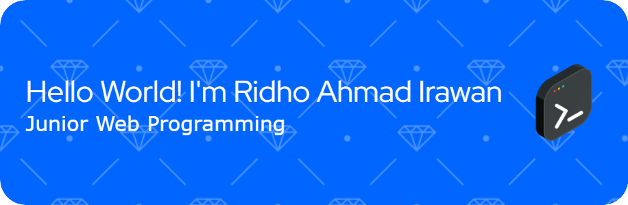

<h1 align="center">Hello World! I'm Ridho Ahmad Irawan 👋</h1>
<h3 align="center">Computer Science Major</h3>
 

<!--  -->

# 💫 About Me:

- 🔭 I am currently studying at <strong>Halu Oleo University</strong>
- 🌱 I am currently learning <strong>JavaScript</strong> and <strong>Python</strong>
- 📫 How to reach me: ridhoahmadirawan281@gmail.com
- ⚡ Fun fact: I’m currently learning to balance <strong>semicolons</strong> and <strong>sleep.</strong>
- 😁😁😁😁

 

---

## 🌐 Socials :

##   

## 💻 Skills :

---

## 📊 GitHub Stats :

      
